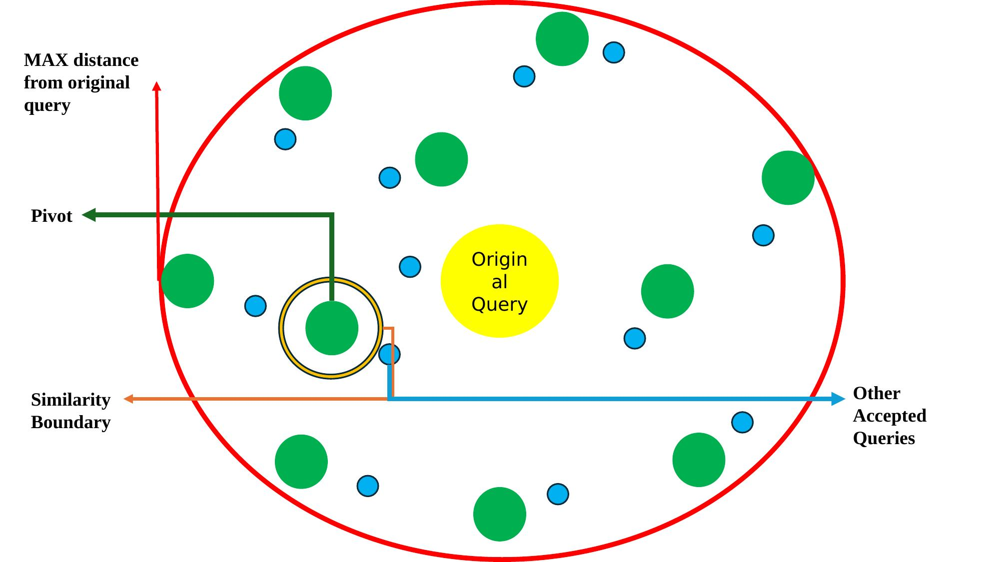

# Asta Query Rephraser

A staged query expansion system for dense retrieval, inspired by the [Asta Paper Finder](https://arxiv.org/abs/2503.03632) (Bragg et al., 2025) from AI2. Implemented as the tryout of the UIUC SPIN undergraduate research program.

---

## Overview

When searching a dense retrieval index, vocabulary mismatches between the user's query and indexed content can cause relevant papers to be missed entirely. This system addresses that problem by automatically generating a **diverse set of semantically grounded expansion queries** from a single original query — maximizing retrieval coverage while minimizing redundancy and downstream computation cost.

The core challenge is twofold:
- **Too few expansions** → insufficient coverage of the user's intent
- **Too many expansions** → excessive downstream computation cost

This implementation controls admission via a three-phase staged mechanism using cosine similarity (query-level semantic diversity) and a softmax-free attention score (token-level structural diversity).



*The red boundary marks the maximum distance from the original query (τ_orig). Green dots are pivots spanning the semantic frontier; blue dots are other accepted queries providing local diversity.*

---

## Pipeline

The system runs in three phases:

### Phase 1 — Stabilization Run
Generates candidate queries and accepts all that pass a cosine safety net against the original query. Simultaneously, it estimates the **adaptive similarity threshold** (τ_pivot) via EMA with bias correction over mean pairwise cosine similarity of accepted pivots. Exits when the last 5 τ_pivot values fall within ±0.002 of their average, or at a hard cap of 25 candidates.

### Phase 2 — Retroactive Re-evaluation
Resets the pivot queue and replays all Phase 1 cached candidates against the now-stable τ_pivot. No new LLM or embedding calls — purely a re-filtering pass to build the initial queue with the correct threshold.

### Phase 3 — Continued Generation
Two-stage filtering for new LLM-generated candidates:

- **Stage 1 (Cosine Novelty):** Rejects if max cosine similarity to any pivot ≥ τ_pivot_stable. Queue is frozen when the sliding window rejection proportion ≥ 0.70 over the last 20 candidates.
- **Stage 2 (Attention Redundancy + Cosine):** After the queue is frozen, candidates are filtered by attention redundancy score AND a cosine upper limit (τ_accept). Queries passing attention redundancy are recorded in the answer set; those also passing the cosine pivot check replace the most redundant pivot in the queue. Stops when rejection proportion ≥ 0.80 over a dynamic window of size `len(queue)`.

Hard cap: 150 total candidates.

---

## Attention Redundancy Score

The token-level redundancy check uses a **softmax-free, identity-projection attention mechanism** for comparability across queries of different lengths. Given pivot A and candidate B with token hidden states X_A ∈ ℝ^(p×d) and X_B ∈ ℝ^(q×d):

```
S_AB  = X_A @ X_B^T                  ∈ ℝ^(p×q)
S_norm = S_AB / (q * sqrt(d))
H_AB  = S_norm @ X_B                  ∈ ℝ^(p×d)
score(A, B) = mean over i of ||H_AB[i, :]||_2

avgRed(B) = mean over A in queue of score(A, B)
```

A high `avgRed` score means the candidate is structurally redundant with respect to the existing pivot set and is rejected. A candidate with `avgRed < worst_pivot_key` is considered novel enough to record — and potentially to replace the most redundant pivot.

---

## Key Parameters

| Parameter | Default | Description |
|---|---|---|
| `tau_orig` | 0.5 / 0.6 | Cosine safety net against original query (query formality dependent) |
| `tau_pivot` | 0.85 | Base cosine novelty threshold for pivot admission |
| `tau_alpha` | 0.15 | Scaling factor for adaptive τ_pivot adjustment |
| `ema_beta` | 0.9 | EMA smoothing factor |
| `tau_stability_band` | 0.002 | Convergence band for stabilization run |
| `tau_stability_avg_window` | 5 | Window size for τ_pivot convergence check |
| `stage1_window_size` | 20 | Sliding window size for Stage 1 freeze detection |
| `stage1_freeze_proportion` | 0.70 | Freeze queue when rejection proportion ≥ this |
| `stage2_stop_proportion` | 0.80 | Stop Stage 2 when rejection proportion ≥ this |
| `tau_accept` | 0.90 | Cosine upper limit for recording in answer set |
| `max_queue_size` | 20 | Maximum pivot queue size |
| `max_candidates` | 150 | Hard cap on total candidates generated |

---

## Models

- **Embedding:** `sentence-transformers/all-MiniLM-L6-v2` (local, CPU)
- **LLM:** `gpt-4o-mini` with two alternating prompt styles drawn directly from Asta's `formulation_prompts.py`

---

## Experimental Results

Results across four representative queries:

| Query | Candidates | Accepted | Pivots | τ_orig |
|---|---|---|---|---|
| Climate + ML (broad) | 54 | 17 | 10 | 0.6 |
| Contrastive learning (narrow) | 55 | 15 | 9 | 0.6 |
| Step-by-step reasoning (natural language) | 64 | 18 | 13 | 0.5 |
| Gradient checkpointing (technical) | 62 | 19 | 11 | 0.5 |

---

## Installation

```bash
git clone https://github.com/Keming-Hu/Asta_Query_Rephraser.git
cd Asta_Query_Rephraser
pip install -r requirements.txt
```

Set your OpenAI API key:

```bash
export OPENAI_API_KEY=your_key_here
```

---

## Usage

```bash
python query_rephrasing.py
```

You will be prompted to enter a search query. The system will run all three phases and print accepted queries and the final pivot queue to the terminal with colored output.

To adjust behavior, edit the `Config` dataclass at the top of `query_rephrasing.py` or instantiate it with custom parameters in your own code:

```python
from query_rephrasing import Config, run_query_expansion

config = Config(tau_orig=0.6, tau_pivot=0.85)
accepted = run_query_expansion(
    original_query="contrastive learning for visual representations",
    config=config,
    openai_api_key="your_key_here"
)
```

---

## Limitations & Future Work

1. **Identity projections in attention:** The redundancy score currently uses W_Q = W_K = W_V = I. Training task-specific weight matrices would improve token-level structural diversity detection.

2. **Fixed global boundary (τ_orig):** The cosine safety net against the original query is a static value. An adaptive mechanism tied to query formality or domain would better prevent semantic drift for diverse query types.

Both improvements would ideally be connected to the downstream retrieval output for gradient-based or reinforcement learning fine-tuning.

---

## Reference

Bragg, J., D'Arcy, M., Balepur, N., et al. (2025). *AstaBench: Rigorous benchmarking of AI agents with a scientific research suite.* arXiv. [https://arxiv.org/abs/2503.03632](https://arxiv.org/abs/2503.03632)

---

## Context

This project was completed as the tryout of the **UIUC SPIN undergraduate research program**. The structural design, implementation, and experimental evaluation were completed by the author. Claude (Sonnet 4.6) was used for assistive coding only.
